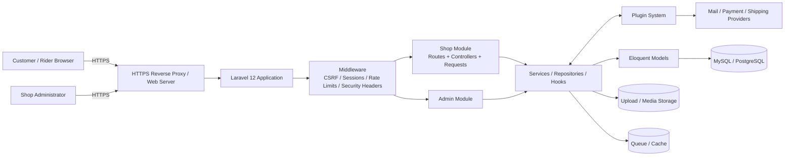
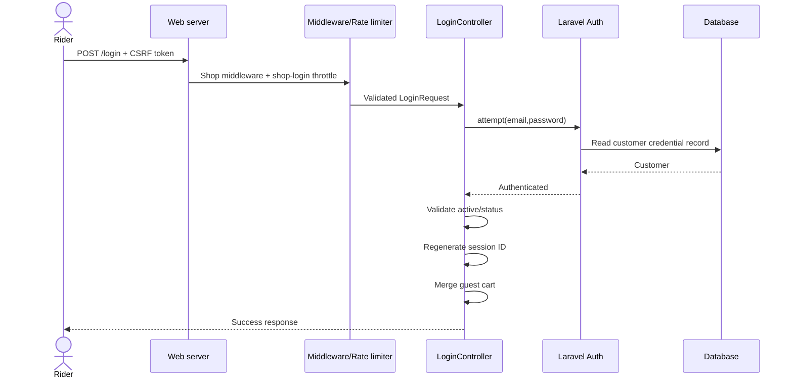
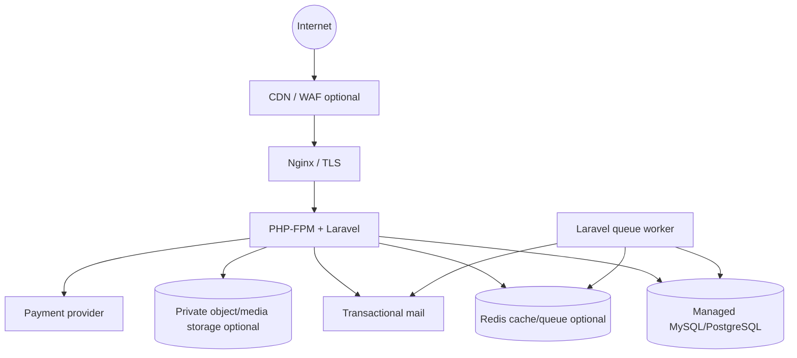

# MotoBayan PH — System Architecture

## 1. Purpose and scope

MotoBayan PH is a Philippines-focused motorcycle parts and riding-gear storefront remodeled from the BeikeShop ecommerce codebase. The remodel keeps the existing Laravel commerce engine, admin area, plugin/hook system, checkout flow and Eloquent data model, while replacing the default fashion-oriented demo catalog, visual identity and storefront styling.

**Proposed public name:** MotoBayan PH  
**Proposed website name:** MotoBayan.ph  
**Important:** `MotoBayan.ph` is a project/branding suggestion only. Domain ownership or registration availability is not asserted by this repository.

## 2. Runtime stack

| Layer | Technology | Responsibility |
|---|---|---|
| Web entry point | Nginx/Apache -> `public/index.php` | TLS termination, static assets, PHP handoff |
| Application | PHP 8.2+, Laravel 12 | Routing, middleware, sessions, validation, controllers, queues |
| Storefront UI | Blade, Bootstrap 5, jQuery/Vue-compatible theme code, Sass | Customer storefront and responsive UI |
| Admin UI | BeikeShop admin module | Catalog, orders, settings, customers, plugins |
| Domain modules | `beike/`, `app/`, plugins | Commerce logic and application services |
| Persistence | Eloquent ORM + MySQL/PostgreSQL | Products, categories, customers, carts, orders, settings |
| Storage | Laravel filesystem disks | Product media, customer uploads, logs |
| Async/integration | Queue, mail, payment/shipping plugins | Deferred jobs and external providers |

## 3. High-level component architecture

## 4. Request flow

### 4.1 Storefront page request

1. The browser sends an HTTPS request to the web server.
2. Laravel global middleware establishes host/proxy handling and adds response security headers.
3. The `shop` middleware group starts the encrypted session, sets timezone/locale, validates CSRF on state-changing requests, shares view data, applies maintenance rules and performs route-model binding.
4. A Shop controller calls repository/service logic.
5. Eloquent retrieves data from the database.
6. Blade renders the default theme plus the MotoBayan brand layer.
7. The response returns with security headers.

### 4.2 Login flow

### 4.3 Checkout flow

Cart and checkout routes run behind the existing `checkout_auth` middleware. The application resolves products/prices from server-side models, creates or updates cart/order records, and delegates payment behavior to configured plugins. The MotoBayan seed disables payment plugins by default and does not ship secrets.

## 5. Module boundaries

### `beike/Shop`
Customer-facing controllers, requests and routes. Examples include product browsing, cart, checkout, account management, uploads and authentication.

### `beike/Admin`
Back-office management surface for products, categories, settings, orders, customers and plugins.

### Services, repositories and models
The codebase uses services/repositories to keep business/data access logic out of Blade templates. Eloquent models persist domain data. Hooks allow extensions without replacing core files.

### Plugins
Payment, shipping and optional features can be attached through the BeikeShop plugin/hook architecture. Treat each plugin as separately trusted code and review it before production installation.

### Theme
The active storefront is still the upstream-compatible `default` theme, with MotoBayan-specific assets in:

- `public/image/motobayan/`
- `resources/beike/shop/default/css/motobayan.scss`
- `public/build/beike/shop/default/css/motobayan.css` (prebuilt fallback brand layer)
- `database/seeders/ThemeSeeder.php`

Keeping the brand layer separate reduces the diff against upstream theme files.

## 6. Seed/demo domain model

MotoBayan demo data focuses on common motorcycle use cases in the Philippines:

- 7 categories: performance/suspension, brakes/safety, helmets/gear, maintenance/fluids, electrical/lighting, drivetrain/wheels and touring/accessories.
- 12 sample products with PHP prices.
- 8 fictional brands.
- Philippines (`country_id=168`) and Cavite (`zone_id=2575`) as seed location context.
- Philippine Peso as the seeded currency.
- Flat-rate sample shipping.

All product/brand names and graphics are demo content; they are not claims of affiliation with real manufacturers.

## 7. Frontend build strategy

The base project currently compiles Sass/JS with Laravel Mix (`webpack.mix.js`). Laravel 12 applications normally use Vite as the modern first-party frontend integration, but BeikeShop's theme/plugin build paths and Blade `mix()` references are coupled to Mix. For this remodel:

- customer-facing deprecated/legacy patterns that could be safely changed were updated (Bootstrap 5 data attributes and `document.write()` locale loading);
- the MotoBayan CSS source is added to the Mix pipeline;
- a prebuilt `motobayan.css` fallback is included so the brand layer is available even before a full asset build;
- a full Mix-to-Vite migration is deliberately deferred until all theme/plugin asset contracts can be regression-tested together.

This is a compatibility decision, not a recommendation to use Mix for a new Laravel project.

## 8. Suggested production deployment

Production should run behind HTTPS, with `.env` outside version control, `APP_DEBUG=false`, a generated `APP_KEY`, secure cookies, least-privilege database credentials, backups and centralized logs. See [SECURITY.md](SECURITY.md).

## 9. Key extension points

- Add real motorcycle fitment data as a normalized compatibility model rather than free-text only.
- Add inventory per warehouse/branch if the business expands beyond one fulfillment location.
- Add shipment tracking through a reviewed courier plugin/API.
- Add production payment providers only through server-side credentials stored in environment/secret management.
- Add product-search indexing when catalog size warrants it.

## 10. Architecture decisions recorded in this remodel

1. **Reuse the Laravel commerce core** instead of rewriting mature cart/order/admin functions.
2. **Replace demo identity/data** rather than modifying the original fashion data in-place.
3. **Keep BeikeShop attribution/license behavior** intact.
4. **Separate MotoBayan visual overrides** from upstream styles where practical.
5. **Harden authentication, uploads and HTTP responses** without changing checkout business semantics.
6. **Defer Vite migration** until plugin/theme compatibility can be tested as one change set.
